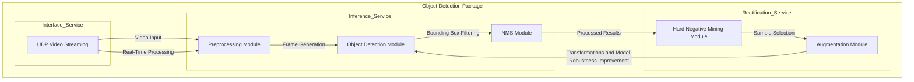
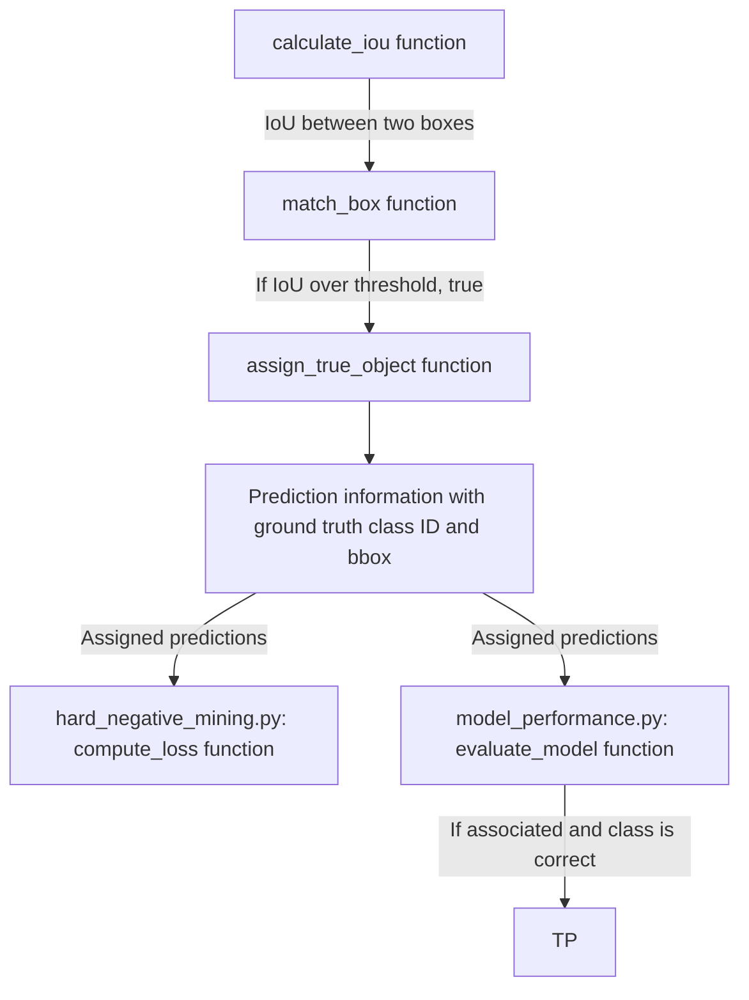

# TechTrack Object Detection System Report

## 1. System Design

This Docker-enabled software package integrates three main services:

### 1.1 Inference Service:

Processes video files to detect objects within frames and saved the results. The Inference Service consists of three main components. First, the preprocessing module [preprocessing.py](infererence\preprocessing.py) reads video files and preprocesses them into frames for object detection, with the capture_video() function generating frames based on a specified drop rate. This module also include load_images_from_zip(), load_image_and_name(), and load_ground_truth() functions to load test images and ground truth information from zip files. The object detection module [object_detection.py](infererence\object_detection.py) defines a Model class that initializes the YOLO model and includes two functions: predict(), which generates initial predictions for each frame, and post_process(), which filters predictions based on a confidence threshold, outputting bounding boxes, class categories, and scores. This module also include functions on saving and reading the txt files on output from predict(), and on bounding box association before post_process(). Finally, the nms module [nms.py](infererence\nms.py) uses non-maximum suppression to refine predictions, implementing the filter() function to optimize bounding box selection. System functionality is demonstrated in [inference_demo.ipynb](notebooks\inference_demo.ipynb) with bounding box visualizations on five images with before and after filter bounding box selections, and [model_performance.ipynb](notebooks\model_performance.ipynb) analyzes two models' performance on the TechTrack Dataset.

### 1.2 Rectification Service: 

Improves model robustness through data augmentation and hard negative mining. The augmentation module [augmentation.py](rectification\augmentation.py) includes six transformation functions, horizontal flipping, Gaussian blur, resizing, random_crop, rotate, and adjust_brightness to enhance the diversity of training data. The hard negative mining module [hard_negative_mining.py](rectification\hard_negative_mining.py) implements a compute_loss() function which calls compute_mse() and calculate_entropy_loss() to measure bounding loss and classification loss between predictions and annotations. Sample_hard_negatives() is implemented to identify and return the top challenging samples, at user's determination on the number of hard images. Analysis notebooks ([augmentation_analysis.ipynb](notebooks\augmentation_analysis.ipynb) and [hard_mining_analysis.ipynb](notebooks\hard_mining_analysis.ipynb)) are used to explore the impacts of augmentation on model performance and examine characteristics of hard samples, providing insight into the model's behavior and hard images from the given dataset.

### 1.3 Interface Service:

Handles video stream input via UDP protocol and allows real-time processing. This service manages video data and routes it to the Inference Service for processing. Initially, streaming is verified locally by using FFmpeg and FFplay commands to stream a test video (worker-zone-detection.mp4) to a designated IP address and port. After confirming streaming functionality, the system extends to the preprocessing module to capture UDP video streams using OpenCV. A Dockerfile is created to containerize the Inference Service, enabling real-time object detection within video streams in a Docker environment.

Below is the diagram on describing the system components and processes.

## 2. Metrics Definition

### 2.1 Offline Metrics:

**True positive, false positive, false negative, recision, recall, mean average precision (mAP), and precision-recall curve** are used to provide a comprehensive view of classification accuracy by measuring the balance between true and false predictions. Additionally, **mean squared error (MSE)** for bounding box regression assesses how accurately the model localizes objects by calculating the squared difference between predicted and true bounding box coordinates, where a lower MSE indicates better spatial alignment. **Entropy loss** for classification evaluates model confidence on classification accuracy, where a high entropy loss may indicate areas for further refinement. These offline metrics collectively offer a detailed assessment of the model's detection capabilities, under flexibility of fine tuning on different parameter thresholds.

### 2.2 Online Metrics:

 Latency and throughput are used as primary metrics for monitoring system performance. **Total model running time, average latency per image, average latency per 100 images, and throughput per second** are measured for both models to indicate the system’s efficiency in handling large volumes of data under production conditions. By monitoring latency and throughput continuously, the system can adapt dynamically to processing demands, providing alert to operators on any lag in responsiveness. **Hard negative error rate** and **average loss** is calculated in [hard_negative_mining.py](rectification\hard_negative_mining.py) as the proportion of hard negative images relative to the total images processed. Average loss (1.9062 for YOLO model 1) measures the average hardness on processing the image dataset and acts as a useful threshold for classifying an image as "hard". Hard negative error rate (22.72% with loss threshold of 2.5 for YOLO model 1) provides a high-level measurement that tracks how frequently the model encounters challenging cases, useful for evaluating the model performance and retaining the model.

## 3. Analysis of System Parameters and Configurations

This section identifies and examines five significant design decisions within the system, explaining their impact and rationale. These choices were informed by performance tests and evidence from the Inference and Rectification Services.

### 3.1 IoU threshold in Box Association (Inference Service)

**Decision**: The system implements box association using Intersection over Union (IoU) to match predicted bounding boxes with ground truth boxes. This matching approach ensures that each prediction is accurately paired to the correct ground truth box. In model performance evaluation, predictions are associated with ground truth boxes if they meet the IoU threshold (0.3) in box association. This acts as the first step in comparing predictions to ground truth and is the foundation of classifying TP, FP, and FN.

**Rationale**: The assign_true_object function uses IoU to match each predicted box to its nearest ground truth box if the overlap exceeds a defined threshold. When a match occurs, it assigns the ground truth class ID and bounding box to the prediction, enriching each prediction with relevant ground truth information. The primary rationale for implementing assign_true_object is to ensure precise performance evaluation metrics. Without this box association process, it would be challenging to accurately categorize predictions as true positives (TP), false positives (FP), or false negatives (FN). This function allows downstream processes, like compute_loss and evaluate_model, to determine the quality of predictions.

**Impact**: The IoU-based association helps identify correctly detected objects using user defined IoU threshold. Furthermore, this association allows for detailed insights into cases where the model may struggle, as the FN metric highlights missed detections, and FP identifies boxes with low overlap or wrong class index. In loss function calculation, the association is also the first step to pair the predictiond to ground truth to evaluate the mse and entropy loss.

### 3.2 NMS Filter Threshold Adjustment (Inference Service)

**Decision**: Setting the non-maximum suppression (NMS) IoU threshold to 0.8 optimizes the system's ability to refine predictions by eliminating enough redundant bounding boxes. Effect of elimination with 0.8 threshold is also presented in notebooks\inference_demo.ipynb.

**Rationale**: Testing across various NMS thresholds showed that a threshold of 0.8 reached the best balance between precision and recall by enabling more accurate detection outputs. A table comparing precisions and recalls at different thresholds supports this choice as optimal for precise bounding box selection.

**Impact**: The NMS threshold directly affects the model’s precision by balancing box suppression and recall. A lower threshold aggressively removes overlapping boxes, potentially discarding valid detections, while a higher threshold may retain redundant detections, leading to false positives by keeping unnecessary boxes for the same image. Also it's noted that higher nms threshold leads to longer model running time, as more bounding boxes are retained after the initial filtering, therefore more bounding boxes need further evaluation in subsequent processing steps.

### 3.3 Objectiveness Threshold for Prediction Filtering (Inference Service)

**Decision**: Setting an objectiveness threshold of 0.2 filters out predictions with low confidence, ensuring that only reliable detections are retained.

**Rationale**: The objectiveness threshold directly influences the precision and recall of the model. A lower threshold may introduce more false positives by accepting low-confidence predictions, while a higher threshold may lead to missed detections. Setting it appropriately can provide a balanced approach, retaining high-confidence predictions without discarding too many valid detections.

**Impact**: Tests with various objectiveness thresholds demonstrated that a 0.2 threshold effectively minimized false positives without substantially impacting recall. A table comparing false positives and recall rates across thresholds highlights how 0.2 achieves an optimal balance, leading to more reliable results.

**Below is a table showing some offline and online metrics under different scenarios for the above 3 thresholds:**

| **YOLO 2 Model**                              |         |       |       |       |       |       |       |
|-----------------------------------------------|---------|-------|-------|-------|-------|-------|-------|
| Objectiveness Threshold                       | 0.5     | 0.5   | 0.4   | 0.4   | 0.3   | 0.2   | 0.2   |
| NMS Threshold                                 | 0.4     | 0.6   | 0.7   | 0.7   | 0.8   | 0.8   | 0.8   |
| IoU Threshold for Box Association             | 0.6     | 0.6   | 0.5   | 0.4   | 0.4   | 0.3   | 0.4   |
| **Offline Metrics**                           |         |       |       |       |       |       |       |
| Precision                                     | 0.7408  | 0.7376| 0.7629| 0.8103| 0.7889| 0.7551| 0.7219 |
| Recall                                        | 0.4083  | 0.4231| 0.5448| 0.5586| 0.8069| 0.9819| 0.9911 |
| mAP                                           | 0.377   | 0.3852| 0.4824| 0.4986| 0.7797| 0.8486| 0.8564 |
| **Online Metrics**                            |         |       |       |       |       |       |       |
| Total Running Time (seconds)                  | 230.55  | 237.5057 | 233.39 | 233.39 | 233.12 | 233.11 | 231.24 |
| Throughput (images per second)                | 41.26   | 40.05 | 40.76 | 40.76 | 40.81 | 40.81 | 41.14 |

### 3.4 Loss Threshold for Hard Negatives Selection (Rectification Service)

**Decision**: Setting a total loss threshold of 4.5 for loss function to classify hard images ensures that only challenging images are included in Hard Negative Error Rate calculation.

**Rationale**: Testing revealed a 4.5 threshold to be optimal, given the average loss of 3.8402 for YOLO model 2 with objectiveness threshold set to 0.2 and IoU threshold set to 0.3. This determines the Hard Negative Error Rate of 23.99% and also provides helpful reference on determining how many hard images should be used in retaining process.

**Impact**: A well-chosen threshold can reflect the average hardness on images and help users filter the most challenging cases by setting the appropriate number of hard images wanted. This prevents overwhelming the dataset with noise and improves the retaining efficiency.

| **YOLO 2 Model**                              |         |       |       |       |
|-----------------------------------------------|---------|-------|-------|-------|
| Objectiveness Threshold                       | 0.3     | 0.2   | 0.2   | 0.2   |
| IoU Threshold for Box Association             | 0.6     | 0.5   | 0.4   | 0.3   |
| Loss Threshold                                | 2.5     | 4.5   | 4.5   | 4.5   |
| **Average Loss**                              | 1.9062  | 3.6343| 3.8224| 3.8402|
| **Hard Negative Error Rate**                  | 22.72%  | 23.32%| 23.92%| 23.99%|

### 3.5 Combined Loss Calculation (Rectification Service)

**Decision**: Using a combined loss calculation that includes both cross-entropy for classification and MSE for bounding box localization allows the system to address both classification errors and localization inaccuracies in hard negative mining.

**Impact**: Calculating a combined loss helps the model improve in a balanced way, focusing on cases where it struggles with both classifying objects correctly and aligning bounding boxes accurately. Cross-entropy loss emphasizes the need to improve confidence in correct classifications, while MSE captures how well the model localizes objects within an image. By prioritizing hard negatives with high combined loss, the model can refine its understanding of difficult samples, reducing both false positives and false negatives.
